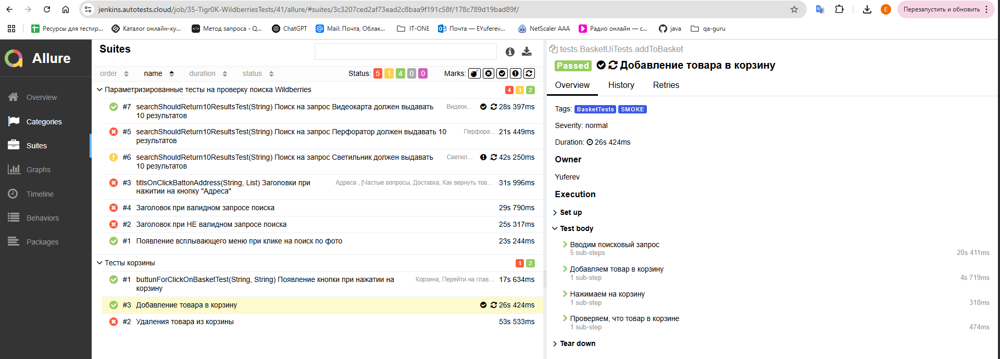
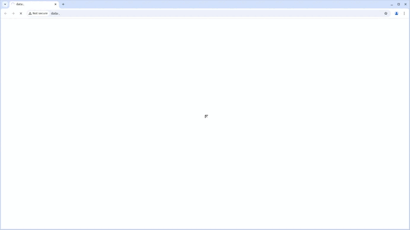

# Проект по автоматизации тестирования сайта "[Wildberries](https://www.wildberries.ru/)"
<p align="center">

</p>

**Wildberries** — цифровая посредническая платформа и крупнейший маркетплейс в России, специализирующийся на продаже товаров различных категорий, включая одежду, обувь, бытовую технику и электронику, товары для дома, косметику и многое другое.   

## :pushpin: Содержание:

- [Технологии и инструменты](#computer-технологии-и-инструменты)
- [Факты о проекте](#clipboard-факты-о-проекте)
- [Примеры автоматизированных тест-кейсов](#heavy_check_mark-примеры-автоматизированных-тест-кейсов)
- [Команды для запуска из терминала](#arrow_forward-команды-для-запуска-из-терминала)
- [Сборка в Jenkins](#-сборка-в-jenkins)
- [Пример Allure-отчета](#-пример-allure-отчета)
- [Уведомления в Telegram с использованием бота](#-уведомления-в-telegram-с-использованием-бота)
- [Видео примера запуска тестов в Selenoid](#clapper-видео-примера-запуска-тестов-в-selenoid)

## :computer: Технологии и инструменты

<p align="center">
<code><a href="https://www.jetbrains.com/idea/"></a></code>
<code><a href="https://www.java.com/"></a></code>
<code><a href="https://junit.org/junit5/"></a></code>
<code><a href="https://gradle.org/"></a></code>
<code><a href="https://selenide.org/"></a></code>
<code><a href="https://aerokube.com/selenoid/"></a></code>
<code><a href="https://github.com/"></a></code>
<code><a href="https://www.jenkins.io/"></a></code>
<code><a href="https://github.com/allure-framework/allure2"></a></code>
<code><a href="https://qameta.io/"></a></code>
<code><a href="https://web.telegram.org/"></a></code>
<code><a href="https://www.atlassian.com/software/jira"></a></code>
</p>

Автотесты написаны на `Java` с использованием фреймворка `Selenide`.\
`Gradle` - сборщик проекта.  \
`JUnit5` - для выполнения тестов.\
`Jenkins` - CI/CD для запуска тестов удаленно.\
`Selenoid` - для удаленного запуска браузера.\
`Allure Report` - для визуализации результатов тестирования.\
`Telegram Bot` - для уведомлений о результатах тестирования.\
`Allure TestOps` - как система управления тестированием.

## :clipboard: Факты о проекте
- [x] Тестовый проект состоит из UI автотестов
- [x] `Page Object` проектирование UI-тестов
- [x] Различные файлы конфигурации для запуска теста в зависимости от параметров сборки
- [x] Конфигурация с библиотекой `Owner`
- [x] Интеграция с `Allure TestOps`
- [x] Автотесты как тестовая документация
- [x] Интеграция с `Jira`

## :heavy_check_mark: Примеры автоматизированных тест-кейсов
- :white_check_mark: Корзина
    - :heavy_check_mark: Добавление товара в корзину
    - :heavy_check_mark: Удаления товара из корзины
    - :heavy_check_mark: Появление кнопки при нажатии на пустую корзину
 - :white_check_mark: Поиск
    - :heavy_check_mark: Поиск на запрос должен выдавать 10 и более результатов
    - :heavy_check_mark: Заголовки при нажитии на кнопку "Адреса"
    - :heavy_check_mark:Заголовок при НЕ валидном запросе поиска
    - :heavy_check_mark:Заголовок при валидном запросе поиска
    - :heavy_check_mark:Появление всплывающего меню при клике на поиск по фото

## :arrow_forward: Команды для запуска из терминала

### *Локальный запуск:*
```
gradle clean test -DrunType=local
```
### *Удалённый запуск через Jenkins:*
```
${Task} -Dbrowser=${browser} -DbroserSize=${browserSize} -DbrowserVersion=${browserVersion} -DremoteUrl=https://user1:1234@${remoteUrl}/wd/hub -DrunType=remote
```
### *Параметры сборки:*

* <code>TASK</code> – задача для запуска.
* <code>remoteUrl</code> - необходимы для для удаленного запуска браузера.
* <code>browser</code> - браузер, в котором будут выполняться тесты.
* <code>browserVersion</code> – версия браузера, в которой будут выполняться тесты.
* <code>browserSize</code> – размер окна браузера, в котором будут выполняться тесты.

##  <a href="https://jenkins.autotests.cloud/job/35-Tigr0K-WildberriesTests/">Сборка в Jenkins</a>
<p align="center">

</p>

##  <a href="https://jenkins.autotests.cloud/job/35-Tigr0K-WildberriesTests/41/allure/">Пример Allure-отчета</a>
### *Основная страница отчёта*

<p align="center">

</p>

### *Тест-кейсы*

<p align="center">

</p>

### *Графики*

<p align="center">

</p>

##  Уведомления в Telegram с использованием бота

После завершения сборки бот в <code>Telegram</code> автоматически обрабатывает и отправляет сообщение с результатом.

<p align="center">

</p>

## :clapper: Видео примера запуска тестов в Selenoid

К каждому тесту в отчете прилагается видео прогона.
<p align="center">
  
</p>

